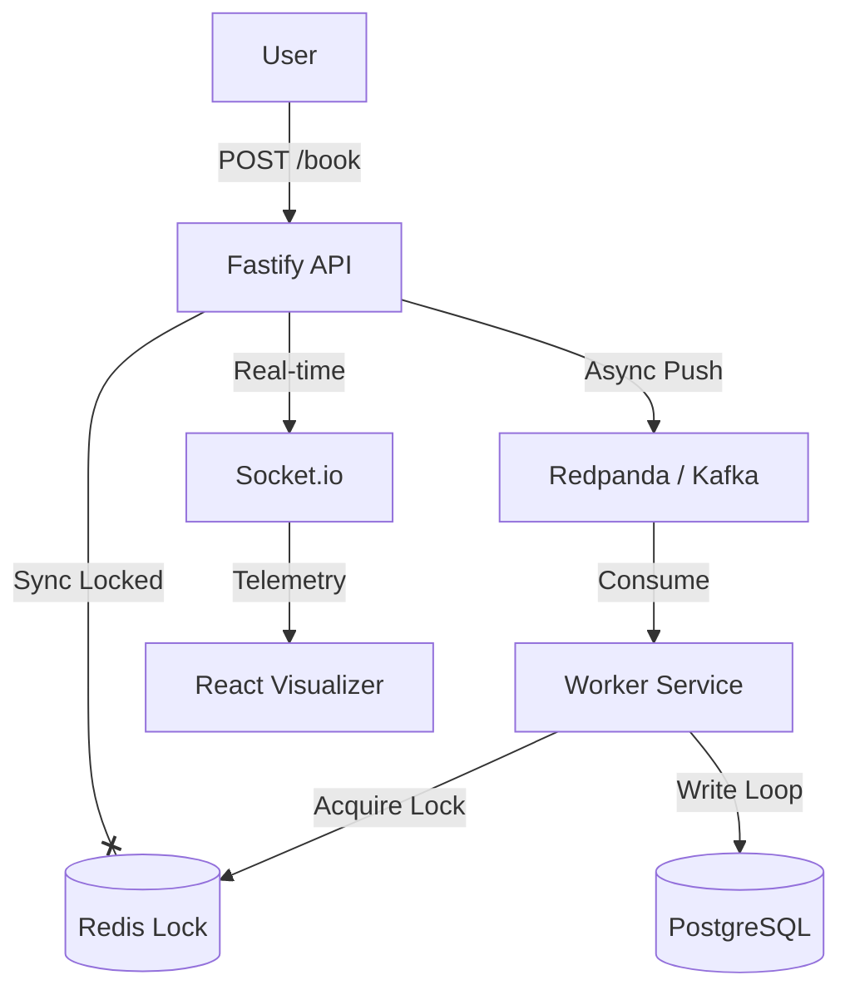

# TicketBlitz ⚡
**High-Performance Distributed Ticketing System**

TicketBlitz is a backend engineering project designed to solve the **"Thundering Herd"** problem in high-concurrency booking systems (like Ticketmaster or Taylor Swift concert sales).

It demonstrates advanced Node.js patterns, Distributed Locking (Redis), and Event-Driven Architecture (Kafka) to handle **10,000 concurrent requests** with zero data corruption.

## 🚀 Key Features

- **🛡️ Race Condition Protection:** Implements **Redis Distributed Locks (Redlock)** via an atomic **Lua Script** unlock.
- **⚡ Event-Driven Architecture:** Uses **Apache Kafka (Redpanda)** to buffer traffic spikes, decoupling the API from the Database.
- **👁️ Engineering Visualizer:** Built-in React dashboard for real-time telemetry (Lock attempts, Kafka events).
- **🏎️ High Performance:** Built with **Fastify** (2x faster than Express) and **Prisma ORM**.
- **🧪 Load Tested:** Verified with **k6** scenarios simulating aggressive traffic (5,000 req/sec).

## 🏗️ Architecture



## 🌐 Production Architecture (Live-Ready)

TicketBlitz is designed for multi-cloud deployment:
- **Frontend:** Vercel (Edge Config Ready)
- **Backend:** Railway (Distributed Service Lifecycle)
- **Database:** Neon (Serverless Postgres)
- **Locks & Events:** Upstash (Serverless Redis & Kafka)

## 🛠️ Tech Stack

- **Backend:** Node.js, TypeScript, Fastify, Socket.io
- **Database:** PostgreSQL, Prisma
- **Infrastructure:** Redis (Locks), Kafka (Queues)
- **Frontend:** React, Vite
- **Testing:** k6 (Load Testing)

## 🏃‍♂️ How to Run

1. **Start Infrastructure:**
   ```bash
   docker compose up -d
   ```

2. **Setup Env:** 
   Copy `.env.example` to `.env` and fill in cloud credentials.

3. **Database Setup:**
   ```bash
   npx prisma db push
   npx ts-node prisma/seed.ts
   ```

4. **Start Components:**
   ```bash
   # Root
   npm run start:api
   npm run start:worker
   
   # Frontend
   cd client && npm run dev
   ```

## 📝 License
MIT
