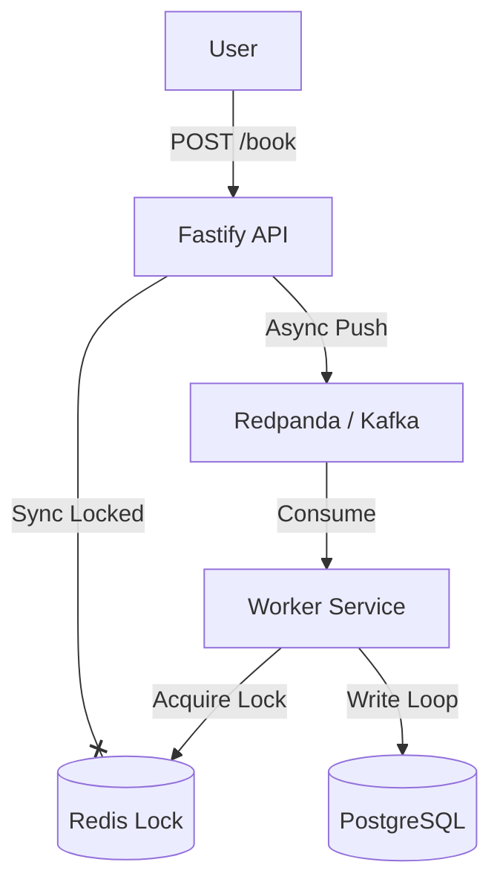

# TicketBlitz ⚡
**High-Performance Distributed Ticketing System**

TicketBlitz is a backend engineering project designed to solve the **"Thundering Herd"** problem in high-concurrency booking systems (like Ticketmaster or Taylor Swift concert sales).

It demonstrates advanced Node.js patterns, Distributed Locking (Redis), and Event-Driven Architecture (Kafka) to handle **10,000 concurrent requests** with zero data corruption.

## 🚀 Key Features

- **🛡️ Race Condition Protection:** Implements **Redis Distributed Locks (Redlock)** to prevent double-booking seats.
- **⚡ Event-Driven Architecture:** Uses **Apache Kafka (Redpanda)** to buffer traffic spikes, decoupling the API from the Database.
- **🏎️ High Performance:** Built with **Fastify** (2x faster than Express) and **Prisma ORM**.
- **🧪 Load Tested:** Verified with **k6** scenarios simulating aggressive traffic (5,000 req/sec).

## 🏗️ Architecture



## 📊  Performance Benchmarks

| Scenario | Strategy | Result |
|----------|----------|--------|
| **Naive Approach** | Direct DB Write | 💥 **CRASH** (Double Bookings & DB Deadlocks) |
| **Secure Approach** | Redis Mutex Lock | ✅ **STABLE** (1 Success, 49 Rejections) |
| **Async Approach** | Kafka Queue | 🚀 **SCALABLE** (100% Accepted, Processed in BG) |

## 🛠️ Tech Stack

- **Backend:** Node.js, TypeScript, Fastify
- **Database:** PostgreSQL, Prisma
- **Infrastructure:** Docker, Docker Compose
- **Message Broker:** Redpanda (Kafka compatible)
- **Testing:** k6 (Load Testing)

## 🏃‍♂️ How to Run

1. **Start Infrastructure:**
   ```bash
   docker compose up -d
   ```

2. **Seed Database:**
   ```bash
   npx prisma db push
   npx ts-node prisma/seed.ts
   ```

3. **Start Components:**
   ```bash
   # Terminal 1: API
   PORT=3000 npx ts-node src/index.ts
   
   # Terminal 2: Worker
   npx ts-node src/worker.ts
   ```

4. **Run Load Test:**
   ```bash
   k6 run load-test.js
   ```

## 📝 License
MIT
